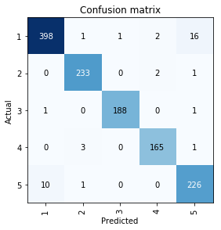
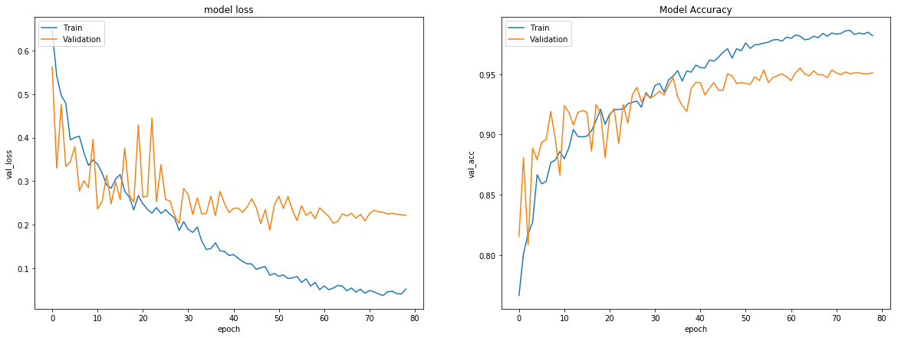

## Ship Image Classification Challenge

Recently I participated in Analytics Vidhya's Game of Deep Learning Hackathon. The aim was to build a model that is able to classify ship type using only the images taken by the survey boats. 
Ship classification has as a wide range of applications, particularly in the areas of maritime safety,  fisheries management, marine pollution,  protection from piracy etc.

There are 5 classes of ships to be detected.

| Ship Category        | Ship Code     |
| ------------- |:-------------:| 
| Cargo      | 1| 
| Military      | 2 | 
| Carrier | 3      |    
| Cruise | 4      |    
| Tankers | 5      |   

 We are provided with 6252 images in train and 2680 images in test data. Further, this is an imbalanced dataset, so some classes have like Cruise have very few images.
 I mainly used fastai and Keras for my experiments. I used kaggle kernels which i will be publicly sharing. The notebooks directory contains the ipynb notebooks which you can download and run on your PC (you may have to replicate the folder structure). The python directory contains notebook code imported as python file.

My final confusion matrix:

Things that worked:
1. Models
I experimented with Resnet 34, 50 and 101. I found Resnet 101 to work best (around 96% 5 fold validation accuracy). I also experimented with Google's newly released EfficientNet. I found pretrained EB0's performance to be very good but still slightly lacking compared to Resnet 101 (around 95.5% 5 fold validation accuracy).
I also experimented with pretrained Xception, Inception V3 and DensenetNet models available in Keras. They result in around 92-95 % 5 fold validation accuracy.
2. Augmentation Strategies

The networks seem to overfit and get 100% training set accuracy very quickly (after around 20 epochs,without any augmentations). To combat overfitting, I used the Albumentations library for image augmentations.
One has to be careful while choosing augmentations. Flipping image around X-avis doesn;t make sense because then the sea will be on top which doesn't make any semantic sense :-) The following Augmenations worked best for me.
* HorizontalFlip,RandomContrast, RandomGamma, RandomBrightness, HueSaturationValue, CutOut adn ShiftScaleRotate.

3. Focal Loss
The confusion matrix shows that some classes like 2 & 4 are very easy to distinguish while some other classes like 1 & 5 are very hard to distinguish.Focal Loss helps prevents the vast number of easy negatives from overwhelming the classifier during training. You can read more about Focal loss [here](https://arxiv.org/abs/1708.02002).

4. Stratified KFold
I used Stratified 5 fold cross validation to train 5 models on different subsets of data. This strategy has two benefits. 
* It enables us to get a better estimate of validation accuracy. 
* It allows us to ensemble the results.

5. Stochastic Weight Averaging and Cosine Annealing Schedule
SWA is an amazing technique which helps us improve the generalization capability of CNN without any further training cost. It basically averages the weights in last few epochs. 
I used Cosine Learning Rate Schedule to train my models. You can read more about this technique in Leslie Smith's paper.

## What can be done to get even better results
You can go for training a second level model based on the OOF (out of fold) predictions of your CNN models. This can help you get better accuracy but this increases the model complexity. I wanted to find the best single model and I didn't want to use brute force, so I stayed away from this technique. But, you should surely give it a try if you desperately want to improve the accuracy.

## What didn't work out

1. Augmentation Strategies like Mixup and RICAP.
2. Smoothing and using soft labels and Pseudo Labelling.
3. Oversampling to combat dataset imbalance.
4. Inception V3, EB3 don't seem to give good performance.

# The Notebooks
The repo currently contains the following notebooks. I will keep adding some other notebooks in the coming days.
1. av-gameofdl-fastai-resnet101
This is a simple notebook which trains resnet 101 using fastai library. On the public LB it gets score of 0.972.
2. av-gameofdl-keras-resnet101-albutfms-bce
In this notebook i use pretrained Resnet 101 in Keras. I use SWA, Augmentation and Cosine Annealing to improve the performance.
3. av-gameofdl-keras-eb0-albutfms-bce
Recently Google unveiled EfficientNet which has fewer parameters but achieves SOTA accuracy in many many datasets. I was curious to see if EfficientNet works on this dataset. The answer is an emphatic YES. It works beautifully and trains very fast. In this notebook you can see my experiment with the EB0 model. Google still hasn't provided pretrained model weights for their best performing model (EB7). Can't wait to check the performance of EB7.

